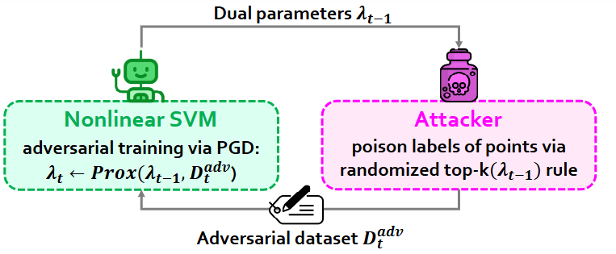

# floral :hibiscus:

This repository contains the code associated with the paper:

> Adversarial Training for Defense Against Label Poisoning Attacks
>
> by [Melis Ilayda Bal](https://melisilaydabal.github.io/), [Volkan Cevher](https://www.epfl.ch/labs/lions/), and [Michael Muehlebach](https://sites.google.com/view/mmuehlebach), ICLR 2025.
> 
[](https://arxiv.org/abs/2502.17121)

## :pushpin: TL;DR:



We propose FLORAL, an adversarial training method that defends against label poisoning attacks by modeling training as a Stackelberg game between an attacker and the learner. Using bilevel optimization and kernel SVMs, FLORAL achieves higher robust accuracy than strong baselines and foundation models under increasing attack budgets.

## :brain: Abstract 

As machine learning models grow in complexity and increasingly rely on publicly sourced data, such as the human-annotated labels used in training large language models, they become more vulnerable to label poisoning attacks. These attacks, in which adversaries subtly alter the labels within a training dataset, can severely degrade model performance, posing significant risks in critical applications. In this paper, we propose FLORAL, a novel adversarial training defense strategy based on support vector machines (SVMs) to counter these threats. Utilizing a bilevel optimization framework, we cast the training process as a non-zero-sum Stackelberg game between an attacker, who strategically poisons critical training labels, and the model, which seeks to recover from such attacks. Our approach accommodates various model architectures and employs a projected gradient descent algorithm with kernel SVMs for adversarial training. We provide a theoretical analysis of our algorithm's convergence properties and empirically evaluate FLORAL's effectiveness across diverse classification tasks. Compared to robust baselines and foundation models such as RoBERTa, FLORAL consistently achieves higher robust accuracy under increasing attacker budgets. These results underscore the potential of FLORAL to enhance the resilience of machine learning models against label poisoning threats, thereby ensuring robust classification in adversarial settings.

---

## 🔧 Setup
Clone the repository, create the environment, and install the dependencies via:
```bash
git clone https://github.com/melisilaydabal/floral.git
cd floral
bash ./scripts/install.sh
```

## Project Structure
```
floral/
├── src/
│   ├── core/             # Main experiment runner and dataset loaders
│   ├── data/             # Dataset generators, loaders, and preprocessing
│   ├── models/           # Classifier models, defenses, and baselines
│   ├── players/          # Attackers and defenders
│   └── utils/            # Metrics, plotting, and utilities
├── dataset/              # Dataset folder
├── scripts/              # Setup and config update scripts
├── configs/              # YAML configuration files
├── workbench/            # Experiment results storage
├── condor_logs/          # Folder for Condor job logs
└── README.md             # Project overview and instructions          
```


## ⚙️ Configuration
Experiment configurations are defined via YAML files under `configs/`.
Example configuration snippet:
```
training:
    batch_size: 32
    num_epochs: 1
    is_adv: True
model:
    name: "svm"
    dir_dump_model: "./pretrained_models"
    gamma:  0.5
    C:  10
    reg_param: 1
    kernel: "rbf"
    degree: 0
optim:
    optimizer: "SGD"
    lr: 0.0001
data:
    dataset: "moon"
    num_classes: 2
    in_dim: 2
    test_size: 0.6
    val_size: 0.2
    dir_dump_data: "./dataset"
    is_train_adv_data: True
    is_train_adv_alfa_data: False   # For alfa attack datasets
    adv_rate: 10
    is_curie_filter: False  # For CURIE baseline
    is_label_sanitize: False    # For LS-SVM baseline
dump:
    dir_dump: "./workbench/"
feature_extract:
    is_feature_extract: False
    model_path: "./pretrained_models/model.pth"
log:
    is_log: True
    logger: "wandb"
player_flip:
    attack_type: "randomized_sv_flip"
    flip_budget: 25
    flip_set_budget: 1
game:
    num_rounds: 501
```
Refer to the paper for hyperparameters and settings experimented.

## 🚀 Usage
Run an experiment:
```
python3 main.py --config=./configs/<CONFIG.YAML> --seed=42
```
or via bash:
```
bash ./scritps/run_experiments.sh
```
If one uses the HT Condor cluster, submit the job with:
```
condor_submit ./scripts/condor_experiment.sub
```
To fine-tune a RoBERTa model on the IMDB dataset, run the script:
```
python3 ./src/models/roberta.py --label_flip_rate 0.05 --dir_load_data ./dataset/imdb/
```
which requires the preprocessed datasets (`.pt` files).
For this, follow the instructions in the `./src/models/roberta.py` file.


## 📊 Logging & Visualization
Experiment results (loss, flip history) are saved as `.out` files under `workbench/`.
Decision boundary plots and logs are automatically saved for the first and the last rounds.

To plot the results, use the path to the results directory (parent directory path of the experiment folder):
```
python3 src/utils/perf_plotter_main.py -m <MEASURE=accuracy,loss> <BASE_FOLDER_PATH_CONTAINING_RESULTS> -d <DUMP_FOLDER_PATH>
Example:
python3 src/utils/perf_plotter_main.py -m accuracy ./workbench -d ./results
```

## License

This project is licensed under the MIT License. See the LICENSE file for more details.

## Citation

If you use this code in your research, please cite our paper:

```bibtex
@article{bal_floral,
      title={Adversarial Training for Defense Against Label Poisoning Attacks},
      author={Melis Ilayda Bal, Volkan Cevher, Michael Muehlebach},
      year={2025},
      journal={International Conference on Learning Representations (ICLR)},
}
```

